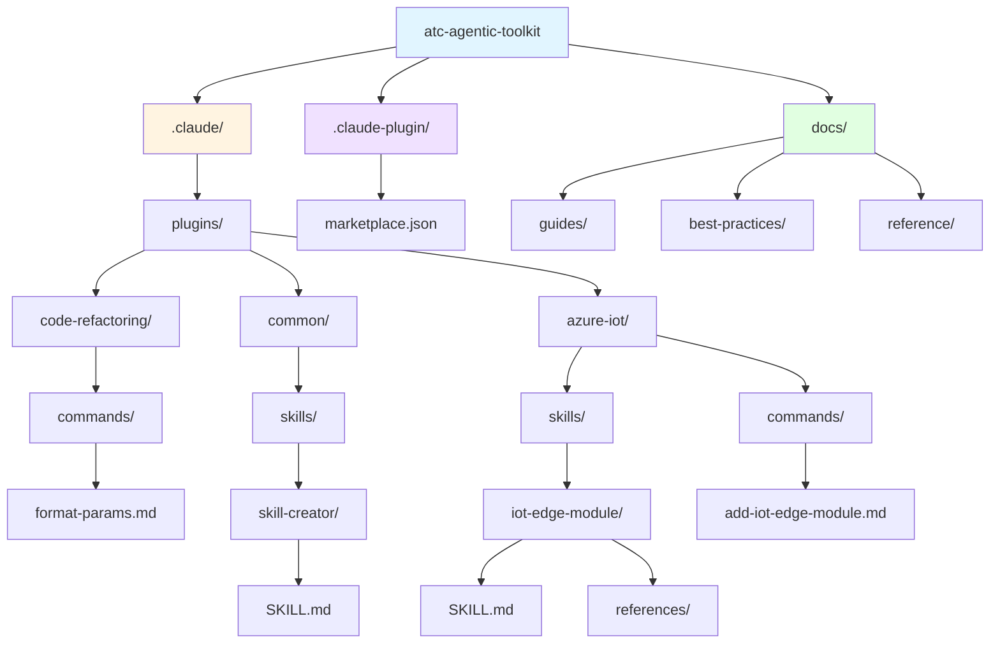

# ATC Agentic Toolkit


**Standardize and accelerate AI-assisted development across teams**

A curated collection of prompts, skills, plugins, and best practices for AI coding agents. The ATC Agentic Toolkit provides production-ready configurations and reusable components for Claude Code and GitHub Copilot, with a focus on .NET development and enterprise patterns.

---

## Table of Contents

- [ATC Agentic Toolkit](#atc-agentic-toolkit)
  - [Table of Contents](#table-of-contents)
  - [What is ATC Agentic Toolkit?](#what-is-atc-agentic-toolkit)
  - [Key Features](#key-features)
    - [Plugin Marketplace](#plugin-marketplace)
    - [Skill Framework](#skill-framework)
    - [.NET-First Approach](#net-first-approach)
    - [Production-Ready Tooling](#production-ready-tooling)
  - [Quick Start](#quick-start)
    - [For Claude Code](#for-claude-code)
    - [For GitHub Copilot (Coming Soon)](#for-github-copilot-coming-soon)
  - [Available Plugins](#available-plugins)
    - [code-refactoring](#code-refactoring)
    - [common](#common)
    - [azure-iot](#azure-iot)
  - [Project Structure](#project-structure)
  - [Plugin Development](#plugin-development)
  - [AI Assistant Support](#ai-assistant-support)
    - [Claude Code](#claude-code)
    - [GitHub Copilot (Coming Soon)](#github-copilot-coming-soon)
  - [Requirements](#requirements)
    - [Required](#required)
    - [Verify Installation](#verify-installation)
  - [Documentation](#documentation)
    - [Guides](#guides)
    - [Best Practices](#best-practices)
    - [Reference](#reference)
  - [Troubleshooting](#troubleshooting)
    - [Plugin Not Found](#plugin-not-found)
    - [Command Not Available](#command-not-available)
    - [Installation Issues](#installation-issues)
  - [How to contribute](#how-to-contribute)

---

## What is ATC Agentic Toolkit?

AI coding assistants like Claude Code and GitHub Copilot are transforming software development, but without standardized configurations, teams face:

- **Inconsistent agent behavior** across projects and developers
- **Repeated context setup** for common tasks
- **Lost productivity gains** from reinventing prompts and workflows
- **Knowledge silos** where effective patterns aren't shared

ATC Agentic Toolkit solves this by providing:

- ✅ **Reusable Components** - Skills, agents, commands, and plugins that work out of the box
- ✅ **Team Consistency** - Standardized configurations that ensure predictable AI behavior
- ✅ **Enterprise-Ready** - Production patterns for .NET, Azure, and enterprise development
- ✅ **Extensible Framework** - Custom marketplace system for distributing internal tooling

---

## Key Features

### Plugin Marketplace

Custom plugin distribution system with namespace support, version management, and dependency resolution. Plugins can bundle skills, agents, commands, and documentation for seamless installation.

### Skill Framework

Modular, discoverable expertise packages that extend Claude Code with specialized capabilities. Skills use progressive disclosure (metadata → instructions → bundled resources) for optimal context management.

### .NET-First Approach

Enterprise patterns built-in: service injection, structured logging, ATC-Net conventions, and Azure integrations. Designed for teams using C#, ASP.NET Core, and Azure services.

### Production-Ready Tooling

Not just examples—provides automated scaffolding and best practice enforcement.

---

## Quick Start

### For Claude Code

**1. Add the ATC-Net Marketplace**

In Claude Code, add the atc-net marketplace to access all available plugins:

```
Add the atc-net marketplace from https://github.com/atc-net/atc-agentic-toolkit
```

**2. Install Plugins**

Install desired plugins from the marketplace:

```
Install the azure-iot plugin from the atc-net marketplace
```

### For GitHub Copilot (Coming Soon)

**Using the Updater CLI Tool**

An updater CLI tool will be available to fetch the newest versions of configuration files for GitHub Copilot integration.

---

## Available Plugins

### code-refactoring

**Code refactoring tools for applying consistent formatting and style across C# projects**

- **Category**: Utilities
- **Version**: 1.0.0
- **Keywords**: refactoring, code-quality, formatting, csharp, dotnet, cleanup

**Commands:**

- `/format-params` - Formats C# method parameters across all `.cs` files for consistency

**Usage:**

```
/format-params
```

**Use Cases:**

- Enforce parameter formatting standards across large codebases
- Maintain consistent code style for team projects
- Prepare code for pull request reviews

---

### common

**Common base skills, plugins, commands, and utilities**

- **Category**: Utilities
- **Version**: 1.0.0
- **Keywords**: skills, utilities, skill-creator, base, common, scaffolding, templates, development

**Skills:**

- **skill-creator** - Scaffolds new Claude Code skills with complete structure, metadata, and documentation

**Features:**

- Progressive disclosure template (metadata → instructions → bundled resources)
- Best practices built-in (context management, clear instructions, examples)
- Interactive prompts for skill configuration
- Automatic file structure generation

**Usage:**

```markdown
Use the skill-creator skill to create a new skill named api-generator that scaffolds REST API endpoints
```

**Use Cases:**

- Create custom skills for domain-specific workflows
- Standardize skill structure across your organization
- Build reusable expertise packages for team distribution

---

### azure-iot

**Azure IoT services automation and scaffolding for IoT Edge modules, IoT Hub, and related services**

- **Category**: Utilities
- **Version**: 1.0.0
- **Keywords**: azure, iot-edge, iot-hub, scaffolding, modules, deployment, dotnet, csharp

**Skills:**

- **iot-edge-module** - Scaffolds complete Azure IoT Edge modules with .NET project structure, Dockerfiles, and deployment manifests

**Features:**

- Creates module with .NET project structure
- Generates Dockerfiles for development and production
- Adds module to deployment manifest
- Integrates with existing .NET solutions
- Supports first-module scenarios
- Includes logging, service patterns, and constants

**Commands:**
- `/add-iot-edge-module [ModuleName] "[Description]"` - Quick command for module creation

**Usage:**

Using the skill:
```
Use the iot-edge-module skill to create a new module named TemperatureSensor
```

Using the slash command:
```
/add-iot-edge-module TemperatureSensor "Processes temperature data from sensors"
```

**Use Cases:**

- Rapid IoT Edge module development
- Standardize module structure across IoT projects
- Automate deployment manifest updates
- Onboard new developers to IoT Edge development

---

## Project Structure



**Key Directories:**

- `.claude/plugins/` - Plugin implementations (skills, agents, commands, configs)
- `.claude-plugin/` - Marketplace configuration and metadata
- `docs/` - Comprehensive documentation (guides, best practices, reference)

---

## Plugin Development

Want to create your own plugins? The ATC Agentic Toolkit provides a complete framework for developing, testing, and distributing custom plugins.

<details>
<summary><strong>Quick Plugin Creation</strong></summary>

1. **Use the skill-creator skill** to generate plugin structure
2. **Define your plugin** in `.claude-plugin/marketplace.json`
3. **Create skills, agents, and commands** in `.claude/plugins/[your-plugin]/`
4. **Test locally** in your project
5. **Distribute** via marketplace or direct installation

See [Plugin Development Guide](docs/guides/plugin-development.md) for detailed instructions.

</details>

**Documentation:**

- [Plugin Development Guide](docs/guides/plugin-development.md) - Complete walkthrough
- [Skill Creation Guide](docs/guides/skill-creation.md) - Building effective skills
- [Command Creation Guide](docs/guides/command-creation.md) - Writing slash commands
- [Plugin Structure Reference](docs/reference/plugin-structure.md) - Directory layout and files
- [Marketplace Configuration](docs/reference/marketplace-config.md) - marketplace.json specification

---

## AI Assistant Support

### Claude Code

**Status: ✅ Fully Supported**

ATC Agentic Toolkit is designed for Claude Code with native support for:

- Skills (modular expertise packages)
- Slash Commands (quick task invocation)
- Plugin Marketplace (custom distribution)
- Context Management (progressive disclosure)

**Getting Started:**

1. Install Claude Code CLI
2. Add the atc-net marketplace
3. Install selected plugins from the marketplace
4. Invoke skills, agents, and commands in your projects

**Best Practices:**

- [Claude Code Fundamentals](docs/best-practices/claude-code-fundamentals.md)
- [Effective Prompts](docs/best-practices/effective-prompts.md)
- [Context Management](docs/best-practices/context-management.md)
- [Team Standards](docs/best-practices/team-standards.md)

---

### GitHub Copilot (Coming Soon)

**Status: 🚧 Planned**

GitHub Copilot support is planned for a future release. The toolkit will include:
- `.github/copilot-instructions.md` - Auto-discovered instructions
- Copilot-specific prompt templates
- Shared best practices (common to Claude Code and Copilot)
- Multi-assistant workflow guidance

---

## Requirements

### Required

- **.NET SDK** (9.0 or higher) - [Download](https://dotnet.microsoft.com/download)
- **Python 3.x** - [Download](https://www.python.org/downloads/)
- **Claude Code CLI** - [Installation Guide](https://docs.claude.com/claude-code)
- **Git** - [Download](https://git-scm.com/downloads)

### Verify Installation

```bash
dotnet --version    # Should show 9.0 or higher
python --version    # Should show 3.x
claude --version    # Should show Claude Code CLI version
git --version       # Should show Git version
```

---

## Documentation

Comprehensive documentation is available in the `docs/` directory:

### Guides

- [Plugin Development](docs/guides/plugin-development.md) - Creating plugins
- [Skill Creation](docs/guides/skill-creation.md) - Building skills
- [Agent Creation](docs/guides/agent-creation.md) - Building specialized agents
- [Command Creation](docs/guides/command-creation.md) - Writing slash commands

### Best Practices

- [Claude Code Fundamentals](docs/best-practices/claude-code-fundamentals.md) - Core concepts
- [Effective Prompts](docs/best-practices/effective-prompts.md) - Prompt engineering
- [Context Management](docs/best-practices/context-management.md) - Advanced techniques
- [Team Standards](docs/best-practices/team-standards.md) - ATC-Net conventions

### Reference

- [Plugin Structure](docs/reference/plugin-structure.md) - Directory layout
- [Skill Anatomy](docs/reference/skill-anatomy.md) - SKILL.md format
- [Agent Anatomy](docs/reference/agent-anatomy.md) - Agent .md format
- [Marketplace Config](docs/reference/marketplace-config.md) - marketplace.json schema

---

## Troubleshooting

### Plugin Not Found

**Issue:** Claude Code doesn't recognize the plugin or skill.

**Solutions:**
- Verify the marketplace was added correctly
- Check that the plugin was installed from the marketplace
- Restart Claude Code CLI
- Check for typos in skill invocation

### Command Not Available

**Issue:** Slash command doesn't autocomplete or work.

**Solutions:**
- Verify the plugin containing the command is installed
- Restart Claude Code CLI
- Check command syntax in plugin documentation

### Installation Issues

**Issue:** Cannot install plugin from marketplace.

**Solutions:**
- Verify Claude Code CLI is up to date
- Check network connection to GitHub
- Ensure the marketplace URL is correct
- Try removing and re-adding the marketplace

---

## How to contribute

[Contribution Guidelines](https://atc-net.github.io/introduction/about-atc#how-to-contribute)

[Coding Guidelines](https://atc-net.github.io/introduction/about-atc#coding-guidelines)
