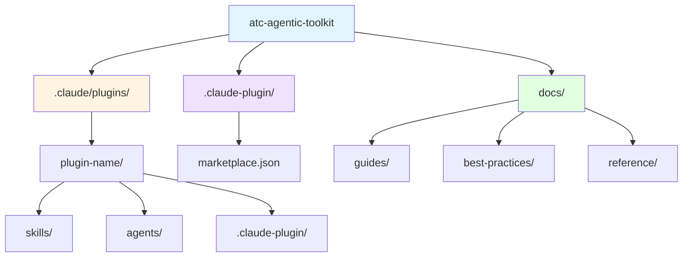

# ATC Agentic Toolkit


**Standardize and accelerate AI-assisted development across teams**

A curated collection of prompts, skills, plugins, and best practices for AI coding agents. The ATC Agentic Toolkit provides production-ready configurations and reusable components for Claude Code and GitHub Copilot, with a focus on .NET development and enterprise patterns.

---

## 📑 Table of Contents

- [ATC Agentic Toolkit](#atc-agentic-toolkit)
  - [📑 Table of Contents](#-table-of-contents)
  - [💡 What is ATC Agentic Toolkit?](#-what-is-atc-agentic-toolkit)
  - [🚀 Quick Start](#-quick-start)
    - [🎨 For Claude Code](#-for-claude-code)
    - [🚧 For GitHub Copilot (Coming Soon)](#-for-github-copilot-coming-soon)
  - [🔌 Available Plugins](#-available-plugins)
  - [📁 Project Structure](#-project-structure)
  - [🛠️ Plugin Development](#️-plugin-development)
  - [✅ Requirements](#-requirements)
  - [📚 Documentation](#-documentation)
    - [📘 Guides](#-guides)
    - [✨ Best Practices](#-best-practices)
    - [📖 Reference](#-reference)
  - [🔧 Troubleshooting](#-troubleshooting)
  - [🤝 How to contribute](#-how-to-contribute)

---

## 💡 What is ATC Agentic Toolkit?

AI coding assistants like Claude Code and GitHub Copilot are transforming software development, but without standardized configurations, teams face:

- **Inconsistent agent behavior** across projects and developers
- **Repeated context setup** for common tasks
- **Lost productivity gains** from reinventing prompts and workflows
- **Knowledge silos** where effective patterns aren't shared

ATC Agentic Toolkit solves this by providing:

- **Reusable Components** - Skills and plugins that work out of the box
- **Team Consistency** - Standardized configurations that ensure predictable AI behavior
- **Enterprise-Ready** - Production patterns for .NET, Azure, and enterprise development
- **Extensible Framework** - Custom marketplace system for distributing internal tooling

---

## 🚀 Quick Start

### 🎨 For Claude Code

**1. Add the ATC-Net Marketplace**

```text
Add the atc-net marketplace from atc-net/atc-agentic-toolkit
```

**2. Install Plugins**

```text
Install the azure-iot plugin from the atc-net marketplace
```

### 🚧 For GitHub Copilot (Coming Soon)

An updater CLI tool will be available to fetch configuration files for GitHub Copilot integration.

---

## 🔌 Available Plugins

| Plugin | Description |
|--------|-------------|
| [code-refactoring](.claude/plugins/code-refactoring/) | Code refactoring and style enforcement skills for C# projects |
| [common](.claude/plugins/common/) | Base utilities and skill creation tools |
| [azure-iot](.claude/plugins/azure-iot/) | Azure IoT Edge module scaffolding and automation |
| [git](.claude/plugins/git/) | Git workflow utilities including commit and PR description generators |
| [hooks](.claude/plugins/hooks/) | Automation hooks for Claude Code sessions - notifications and workflow enhancements |

---

## 📁 Project Structure



**Key Directories:**

- `.claude/plugins/` - Plugin implementations (skills, agents, hooks, configs)
- `.claude-plugin/` - Marketplace configuration and metadata
- `docs/` - Comprehensive documentation (guides, best practices, reference)

---

## 🛠️ Plugin Development

Want to create your own plugins? The toolkit provides a complete framework for developing, testing, and distributing custom plugins.

1. **Use the skill-creator skill** to generate plugin structure
2. **Define your plugin** in `.claude-plugin/marketplace.json`
3. **Create skills** in `.claude/plugins/[your-plugin]/skills/`
4. **Test locally** in your project
5. **Distribute** via marketplace or direct installation

**Documentation:**

- [Plugin Development Guide](docs/guides/plugin-development.md)
- [Skill Creation Guide](docs/guides/skill-creation.md)
- [Plugin Structure Reference](docs/reference/plugin-structure.md)

---

## ✅ Requirements

- **.NET SDK** (9.0 or higher) - [Download](https://dotnet.microsoft.com/download)
- **Python 3.x** - [Download](https://www.python.org/downloads/)
- **Claude Code CLI** - [Installation Guide](https://code.claude.com/docs/en/overview)
- **Git** - [Download](https://git-scm.com/downloads)

```bash
dotnet --version    # Should show 9.0 or higher
python --version    # Should show 3.x
claude --version    # Should show Claude Code CLI version
git --version       # Should show Git version
```

---

## 📚 Documentation

### 📘 Guides

- [Plugin Development](docs/guides/plugin-development.md) - Creating plugins
- [Skill Creation](docs/guides/skill-creation.md) - Building skills
- [Agent Creation](docs/guides/agent-creation.md) - Building specialized agents

### ✨ Best Practices

- [Claude Code Fundamentals](docs/best-practices/claude-code-fundamentals.md) - Core concepts
- [Effective Prompts](docs/best-practices/effective-prompts.md) - Prompt engineering
- [Context Management](docs/best-practices/context-management.md) - Advanced techniques
- [Team Standards](docs/best-practices/team-standards.md) - ATC-Net conventions

### 📖 Reference

- [Plugin Structure](docs/reference/plugin-structure.md) - Directory layout
- [Skill Anatomy](docs/reference/skill-anatomy.md) - SKILL.md format
- [Marketplace Config](docs/reference/marketplace-config.md) - marketplace.json schema

---

## 🔧 Troubleshooting

**Plugin Not Found:** Verify the marketplace was added correctly, check that the plugin was installed, and restart Claude Code CLI.

**Installation Issues:** Ensure Claude Code CLI is up to date, check network connection, and verify the marketplace URL is correct.

---

## 🤝 How to contribute

[Contribution Guidelines](https://atc-net.github.io/introduction/about-atc#how-to-contribute)

[Coding Guidelines](https://atc-net.github.io/introduction/about-atc#coding-guidelines)
