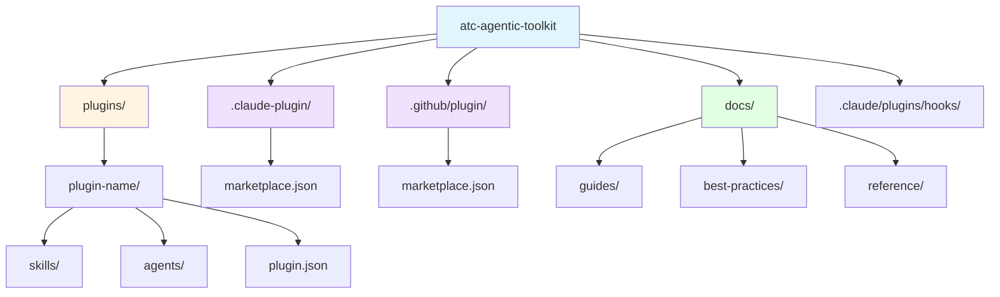

# ATC Agentic Toolkit


**Standardize and accelerate AI-assisted development across teams**

A curated collection of prompts, skills, plugins, and best practices for AI coding agents. The ATC Agentic Toolkit provides production-ready configurations and reusable components for Claude Code and GitHub Copilot, with a focus on .NET development and enterprise patterns.

---

## 📑 Table of Contents

- [ATC Agentic Toolkit](#atc-agentic-toolkit)
  - [📑 Table of Contents](#-table-of-contents)
  - [💡 What is ATC Agentic Toolkit?](#-what-is-atc-agentic-toolkit)
  - [🚀 Quick Start](#-quick-start)
  - [🔌 Available Plugins](#-available-plugins)
  - [📁 Project Structure](#-project-structure)
  - [🛠️ Plugin Development](#️-plugin-development)
  - [✅ Requirements](#-requirements)
  - [📚 Documentation](#-documentation)
    - [📘 Guides](#-guides)
    - [✨ Best Practices](#-best-practices)
    - [📖 Reference](#-reference)
  - [🔧 Troubleshooting](#-troubleshooting)
  - [🤝 How to contribute](#-how-to-contribute)

---

## 💡 What is ATC Agentic Toolkit?

AI coding assistants like Claude Code and GitHub Copilot are transforming software development, but without standardized configurations, teams face:

- **Inconsistent agent behavior** across projects and developers
- **Repeated context setup** for common tasks
- **Lost productivity gains** from reinventing prompts and workflows
- **Knowledge silos** where effective patterns aren't shared

ATC Agentic Toolkit solves this by providing:

- **Reusable Components** - Skills and plugins that work out of the box
- **Team Consistency** - Standardized configurations that ensure predictable AI behavior
- **Enterprise-Ready** - Production patterns for .NET, Azure, and enterprise development
- **Extensible Framework** - Custom marketplace system for distributing internal tooling

---

## 🚀 Quick Start

### 🖥️ Copilot CLI / Claude Code

1. Launch Copilot CLI or Claude Code
2. Add the marketplace:
   ```
   /plugin marketplace add atc-net/atc-agentic-toolkit
   ```
3. Install a plugin:
   ```
   /plugin install <plugin>@atc-agentic-toolkit
   ```
4. Restart to load the new plugins
5. View available skills:
   ```
   /skills
   ```
6. View available agents:
   ```
   /agents
   ```
7. Update plugin (on demand):
   ```
   /plugin update <plugin>@atc-agentic-toolkit
   ```

### 🆚 VS Code / VS Code Insiders (Preview)

> [!IMPORTANT]
> VS Code plugin support is a preview feature and subject to change. You may need to enable it first.

```jsonc
// settings.json
{
  "chat.plugins.enabled": true,
  "chat.plugins.marketplaces": ["atc-net/atc-agentic-toolkit"]
}
```

Once configured, type `/plugins` in Copilot Chat or use the `@agentPlugins` filter in Extensions to browse and install plugins from the marketplace.

---

## 🔌 Available Plugins

| Plugin | Description |
|--------|-------------|
| [common](plugins/common/) | Common base skills including documentation generators, implementation planning, and utility tools |
| [dotnet](plugins/dotnet/) | C#/.NET development skills including refactoring, testing, async patterns, and NuGet management |
| [azure](plugins/azure/) | Azure services skills covering 200+ cloud services, IoT, AI, data, networking, and more |
| [aspire](plugins/aspire/) | Aspire distributed application orchestration skills |
| [git](plugins/git/) | Git workflow utilities including commit message generators and PR descriptions |
| [github](plugins/github/) | GitHub platform skills including CI/CD workflow conventions for GitHub Actions and GitHub issue management |
| [playwright](plugins/playwright/) | Browser automation and testing skills using Playwright |
| [web](plugins/web/) | Web development skills covering HTML, CSS, JavaScript, web APIs, security, performance, and accessibility |
| [security](plugins/security/) | Security best practices and OWASP Top 10 guidelines for secure coding across all languages and frameworks |
| [hooks](.claude/plugins/hooks/) | Automation hooks for Claude Code sessions (Claude Code only) |

---

## 📁 Project Structure


```mermaid
graph TD
    A[atc-agentic-toolkit] --> B[plugins/]
    A --> C[.claude-plugin/]
    A --> G[.github/plugin/]
    A --> D[docs/]
    A --> H[.claude/plugins/hooks/]

    B --> E["plugin-name/"]
    E --> F[skills/]
    E --> I[agents/]
    E --> K[plugin.json]

    C --> J[marketplace.json]
    G --> L[marketplace.json]

    D --> M[guides/]
    D --> N[best-practices/]
    D --> O[reference/]

    style A fill:#e1f5ff
    style B fill:#fff4e1
    style C fill:#f0e1ff
    style G fill:#f0e1ff
    style D fill:#e1ffe1
```

**Key Directories:**

- `plugins/` - Plugin implementations (skills, agents, configs)
- `.claude/plugins/hooks/` - Claude Code specific hooks
- `.claude-plugin/` - Claude Code marketplace configuration
- `.github/plugin/` - GitHub Copilot marketplace configuration
- `docs/` - Comprehensive documentation (guides, best practices, reference)

---

## 🛠️ Plugin Development

Want to create your own plugins? The toolkit provides a complete framework for developing, testing, and distributing custom plugins.

1. **Use the skill-creator skill** to generate plugin structure
2. **Define your plugin** in `plugin.json` at the plugin root
3. **Create skills** in `plugins/[your-plugin]/skills/`
4. **Test locally** in your project
5. **Register** in both `.claude-plugin/marketplace.json` and `.github/plugin/marketplace.json`

**Documentation:**

- [Plugin Development Guide](docs/guides/plugin-development.md)
- [Skill Creation Guide](docs/guides/skill-creation.md)
- [Plugin Structure Reference](docs/reference/plugin-structure.md)

---

## ✅ Requirements

- **.NET SDK** (9.0 or higher) - [Download](https://dotnet.microsoft.com/download)
- **Python 3.x** - [Download](https://www.python.org/downloads/)
- **GitHub Copilot** (CLI or VS Code extension) - or -
- **Claude Code CLI** - [Installation Guide](https://code.claude.com/docs/en/overview)
- **Git** - [Download](https://git-scm.com/downloads)

```bash
dotnet --version    # Should show 9.0 or higher
python --version    # Should show 3.x
claude --version    # Should show Claude Code CLI version
git --version       # Should show Git version
```

---

## 📚 Documentation

### 📘 Guides

- [Plugin Development](docs/guides/plugin-development.md) - Creating plugins
- [Skill Creation](docs/guides/skill-creation.md) - Building skills
- [Agent Creation](docs/guides/agent-creation.md) - Building specialized agents

### ✨ Best Practices

- [Claude Code Fundamentals](docs/best-practices/claude-code-fundamentals.md) - Core concepts
- [Effective Prompts](docs/best-practices/effective-prompts.md) - Prompt engineering
- [Context Management](docs/best-practices/context-management.md) - Advanced techniques
- [Team Standards](docs/best-practices/team-standards.md) - ATC-Net conventions

### 📖 Reference

- [Plugin Structure](docs/reference/plugin-structure.md) - Directory layout
- [Skill Anatomy](docs/reference/skill-anatomy.md) - SKILL.md format
- [Marketplace Config](docs/reference/marketplace-config.md) - marketplace.json schema

---

## 🔧 Troubleshooting

**Plugin Not Found:** Verify the marketplace was added correctly, check that the plugin was installed, and restart Claude Code CLI.

**Installation Issues:** Ensure Claude Code CLI is up to date, check network connection, and verify the marketplace URL is correct.

---

## 🤝 How to contribute

[Contribution Guidelines](https://atc-net.github.io/introduction/about-atc#how-to-contribute)

[Coding Guidelines](https://atc-net.github.io/introduction/about-atc#coding-guidelines)
