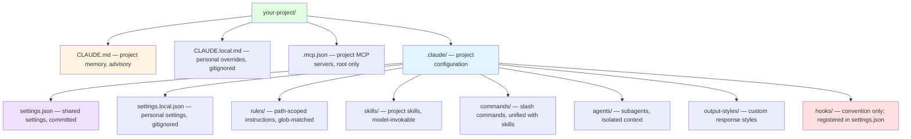

# The `.claude/` Folder, Fully Mapped

Reference for every canonical file and folder Claude Code reads — at the project root, inside
`.claude/`, and at the user level (`~/.claude/`). Use it to understand where configuration lives, what
each file does, and how the pieces are loaded.

> This is a generic Claude Code reference. For how *this toolkit* is laid out (a plugin marketplace),
> see [Plugin Structure](plugin-structure.md) and the Project Structure diagram in the
> [root README](../../README.md).

## Map



> **Loading model in one line:** `CLAUDE.md`/`rules/` are *advisory context*. `settings.json` is
> *configuration*. `hooks` are *deterministic* (they fire on events, but only because they are
> registered in `settings.json`). `skills` load *on demand*.

## Project root

| File | Purpose | Caveats |
|------|---------|---------|
| `CLAUDE.md` | Team-shared project instructions (architecture, conventions, commands), loaded into context at session start. Also valid at `.claude/CLAUDE.md`. | Advisory context, **not** enforced configuration. Keep it concise; very large files reduce adherence. Supports `@path` imports (see below). |
| `CLAUDE.local.md` | Personal, project-specific instructions. | Add to `.gitignore`. Lives only in the worktree where you created it — for cross-worktree personal rules, import from `~/.claude/` instead. |
| `.mcp.json` | Project-scoped MCP server configuration, shared via git. | **Must be at the project root** (not under `.claude/`). Prompts for approval before use; supports `${VAR}` / `${VAR:-default}` expansion. |

### Memory imports (`@path`)

Inside `CLAUDE.md` (or `CLAUDE.local.md`) you can pull in other files inline:

```markdown
See @README.md for an overview and @docs/git-workflow.md for the branching model.
Personal cross-project rules: @~/.claude/my-rules.md
```

Imports expand at launch, resolve relative or absolute (`~/`) paths, and nest up to a few levels deep.

## `.claude/` directory

| Entry | Purpose | Caveats |
|-------|---------|---------|
| `settings.json` | Shared project settings: permissions, hooks registry, env vars, model, theme. | **Committed to git.** Add `"$schema": "https://json.schemastore.org/claude-code-settings.json"` for validation. Most changes hot-reload; `model` and `outputStyle` need a restart. |
| `settings.local.json` | Personal settings overrides for this project. | **Gitignored.** Higher precedence than `settings.json`. |
| `rules/*.md` | Path-scoped instructions. Files with no `paths` frontmatter load unconditionally; files with `paths: ["src/**/*.ts"]` load only when Claude touches matching files. | Real, glob-matched feature — the scalable alternative to one huge `CLAUDE.md`. Also available at `~/.claude/rules/`. |
| `skills/<name>/SKILL.md` | Reusable skills. The directory name is the skill name; YAML frontmatter (`name`, `description`, …) controls invocation. | Canonical home. Auto-invoked when relevant unless `disable-model-invocation: true`. |
| `commands/<name>.md` | Custom slash commands (`/deploy` ← `deploy.md`). | Still supported, but now unified under the skills system — prefer `skills/` for new work. |
| `agents/<name>.md` | Subagent definitions (system prompt + tool/model restrictions), one per file. | Run in an **isolated context window** and return a summary. Listed by `/agents`. |
| `output-styles/<name>.md` | Customize Claude's role/tone/response format via the system prompt. | Activated through `/config` or the `outputStyle` setting; takes effect on a new session. |
| `hooks/` | A **convention** some teams use to store hook scripts. | ⚠️ Not auto-discovered. Hooks only run when **registered in `settings.json`** under the `hooks` key — the scripts can live anywhere. |

### How hooks actually work

There is no magic `hooks/` folder. A hook is a script path registered in `settings.json` against an
event:

```json
{
  "hooks": {
    "PostToolUse": [
      {
        "matcher": "Edit|Write",
        "hooks": [
          { "type": "command", "command": "${CLAUDE_PROJECT_DIR}/.claude/hooks/check-style.sh" }
        ]
      }
    ]
  }
}
```

### The status line is a setting, not a file

The bottom-bar status line is configured as the `statusLine` object in `settings.json` (a command whose
stdout is rendered) — there is no `.claude/statusline` file or directory:

```json
{
  "statusLine": { "type": "command", "command": "path/to/script.sh" }
}
```

## User level: `~/.claude/`

The same building blocks exist at the user level and apply across every project on the machine:

- `settings.json` — user-wide settings
- `CLAUDE.md` — user-wide memory
- `rules/`, `commands/`, `agents/`, `skills/`, `output-styles/` — user-wide equivalents of the project folders

## Settings precedence

When the same setting is defined in multiple places, the higher entry wins:

1. **Managed** (enterprise/admin policy) — highest
2. **Command-line arguments** (e.g. `--model`)
3. **Local** — `.claude/settings.local.json`
4. **Project** — `.claude/settings.json`
5. **User** — `~/.claude/settings.json` — lowest

Permissions are an exception: they **merge** across scopes rather than override.

## Common misconceptions

- **`.claude/hooks/` is not auto-loaded.** Hooks fire only when registered in `settings.json` (see above).
- **`statusline` is not a file.** It is the `statusLine` config object in `settings.json`.
- **Plugins do not live in `.claude/plugins/`.** A plugin is a standalone directory with a
  `.claude-plugin/plugin.json` manifest (this is how every plugin in this repo is structured). Test one
  locally with `claude --plugin-dir ./my-plugin`.
- **`commands/` is not "legacy/dead."** It still works, but commands are now part of the unified skills
  system — prefer `skills/` for new work.

## Resources

- [Plugin Structure Reference](plugin-structure.md) — how plugins in this repo are laid out
- [Skill Anatomy Reference](skill-anatomy.md) — the `SKILL.md` format
- [Agent Anatomy Reference](agent-anatomy.md) — the agent file format
- [Claude Code Fundamentals](../best-practices/claude-code-fundamentals.md) — core concepts and memory
- Official docs: [Settings](https://code.claude.com/docs/en/settings) ·
  [Memory & rules](https://code.claude.com/docs/en/memory) ·
  [Hooks](https://code.claude.com/docs/en/hooks) ·
  [Skills / slash commands](https://code.claude.com/docs/en/slash-commands) ·
  [Subagents](https://code.claude.com/docs/en/sub-agents) ·
  [Output styles](https://code.claude.com/docs/en/output-styles) ·
  [Status line](https://code.claude.com/docs/en/statusline) ·
  [MCP](https://code.claude.com/docs/en/mcp)
